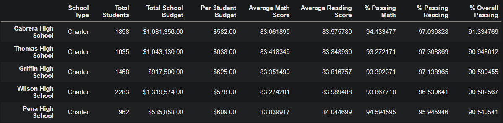

# School District Analysis

## Overview

Maria, the chief data scientist for a city school district is responsible for analysing information and preparing all standardised test data for analysis, reporting, and presentation. She has requested assistance in completing the analysis of the school district. The analysis will assist the school board and superintendent in making decisions regarding the school budgets and priorities.

After the initial analysis, there was evidence showing academic dishonesty; specifically, math and reading scores for Thomas High School ninth graders. Although the school board does not know the full extent of the academic dishonesty, they want to uphold state-testing standards. 

In this analysis, the math and reading scores for Thomas High School ninth graders were replaced with NaNs while keeping the rest of the data intact. The school district analysis was then repeated to show how these changes affected the overall analysis. Below is the list of the deliverables for the analysis of the school district:
-	A high-level snapshot of the district's key metrics, presented in a table format
-	An overview of the key metrics for each school, presented in a table format
-	Tables presenting each of the following metrics:
    -	Top 5 and bottom 5 performing schools, based on the overall passing rate
    -	The average math score received by students in each grade level at each school
    -   The average reading score received by students in each grade level at each school
    -	School performance based on the budget per student
    -	School performance based on the school size 
    -	School performance based on the type of school

## Results

### District Summary

**District Summary Before NaNs**

**District Summary After NaNs**

The district summary was not significantly affected after the grades were replaced with NaNs. The “Average Math Score” went down by 0.1 points, the “Average Reading Score” had no changes, and the “% Passing Math”, “% Passing Reading”, and “% Overall Passing” all went down by 1 percent.

### School Summary

**School Summary Before NaNs**

**School Summary After NaNs**

The only school affected after the scores were replaced in the school summary was Thomas High School. There were barely any changes to the average scores; the “Average Math Score” remained the same and the “Average Reading Score” increased by 0.1 points. However, the passing percentages decreased significantly; the “% Passing Math” decreased by 26% from 93% to 67%, the “% Passing Reading” decreased by 27% from 97% to 70%, and the “% Overall Passing” decreased by 26% from 91% to 65%.

### Top 5 Performing Schools & Bottom 5 Performing Schools, based on overall passing rate

**Top 5 Performing Schools Before NaNs**

**Top 5 Performing Schools After NaNs**

**Bottom 5 Performing Schools Before NaNs**

**Bottom 5 Performing Schools After NaNs**

Thomas High School was ranked 2nd in the top 5 performing schools in the district before the ninth graders’ math and reading scores were replaced with NaNs. Thomas High School has since dropped to 8th place and no longer in the top 5 performing schools. The bottom 5 performing schools did not change.

### Average Math & Reading Scores by Grade

**Average Math Scores Before NaNs**

**Average Math Scores After NaNs**

**Average Reading Scores Before NaNs**

**Average Reading Scores After NaNs**

The only grades affected were math and reading scores from 9th graders in Thomas High School. All other grades from all other schools were not affected.

### School performance based on the budget per student

### School performance based on the school size

### School performance based on the type of school

## Summary
Summarize four major changes in the updated school district analysis after reading and math scores for the ninth grade at Thomas High School have been replaced with NaNs.

